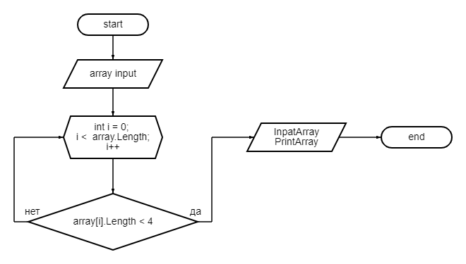

# **Итоговая проверочная работа**

## Блок-схема алгоритма:

## *Задача* - *Написать программу, которая из имеющегося массива строк формирует массив из строк, длина которых меньше или равна 3 символам*.

## Описание алгоритма решения:
* Создаём массив с возможностью ввода пользователем количества элементов массива.
* Наполняем массив элементами, которые пользователь вводит с консоли.
* Выводим на экран введённый пользователем массив.
* Находим в исходном массиве элементы, количество символов в которых не привышает 3, и выводим их на экран.

## Описание функций, которые  использовали при решении:
* InputArray - для ввода массива пользователем.
* PrintArray - создание и вывод запрашиваемого по условию задачи массива.
